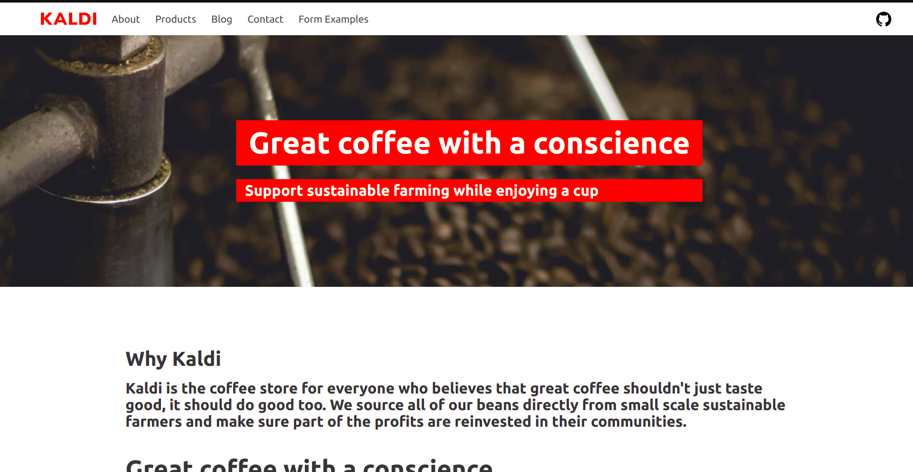

# practice_list
一時的にポートフォリオの代わりとして作成、公開。

## 01_fizz_buzz.rb
かの有名なfizz_buzz

## 02_color_converter.rb
RGB値とhtmlカラーコードとで色の値を変換するプログラム。

『プロを目指す人のためのRuby入門』を読む課程で作成したもの。
### 機能
- あるRGB値を入力するとhtmlカラーコードを返す。例：255,255,255=>#ffffff
- あるhtmlカラーコードを入力するとRGB値を返す。例：#ffffff=>255,255,255
- ついでに入力した色を表す[原色大辞典](https://www.colordic.org/)のWebページを開く(但し、Linux限定)

## 03_docker_deploy_kaldy
dockerの練習がてらカスタムコンテナを作成し、[gatsby-starter-netlify-cms](https://github.com/netlify-templates/gatsby-starter-netlify-cms)をデプロイしてみました。
### 手順
```
git clone https://github.com/netlify-templates/gatsby-starter-netlify-cms.git
cd gatsby-starter-netlify-cms
mv Dockerfile default.conf .dockerignore gatsby-starter-netlify-cms/
# build
docker build -t gatsby-starter-netlify/website .
# コンテナを実行してデプロイする
docker run --rm -p 80:80 gatsby-starter-netlify/website
```
#### 上手く行ったら

#### 上手く行かないときは
starterページの[このissue](https://github.com/netlify-templates/gatsby-starter-netlify-cms/issues/659)を参考にgatsby-config.jsを書き換えることで上手く行くかも知れません。
### これを通して出来るようになったこと
- dockerカスタムコンテナの作成

## 99_その他
現状、ポートフォリオと呼べるようなものが無いので、色々羅列しておきます。

- アルバイト先で作成しているWebサイト：[名大の授業](https://ocw.nagoya-u.jp/ja/)
- 最近始めたAtCoder：[sardine_bird](https://atcoder.jp/users/sardine_bird)
